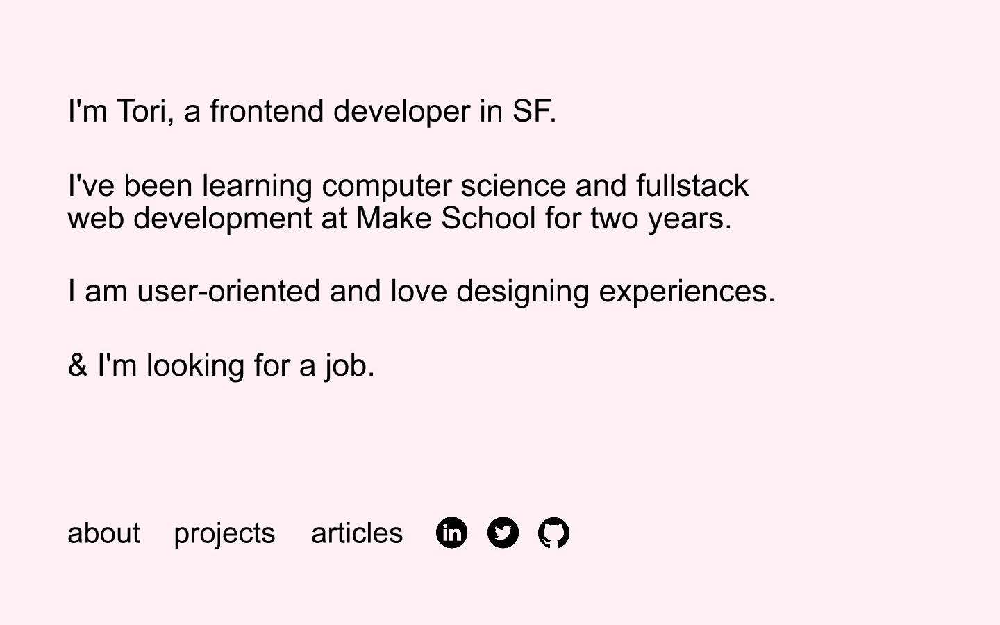
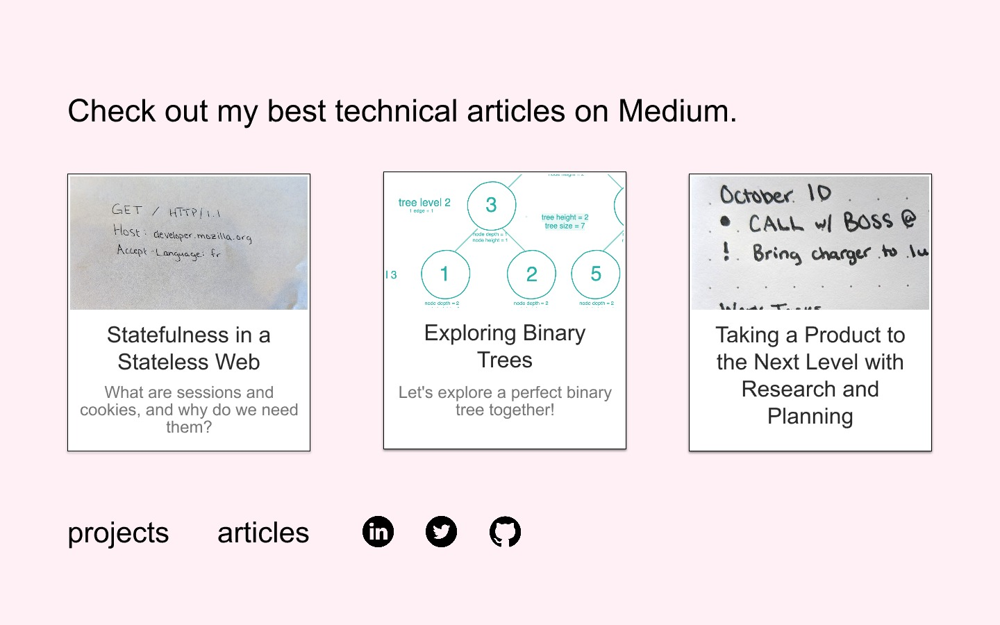
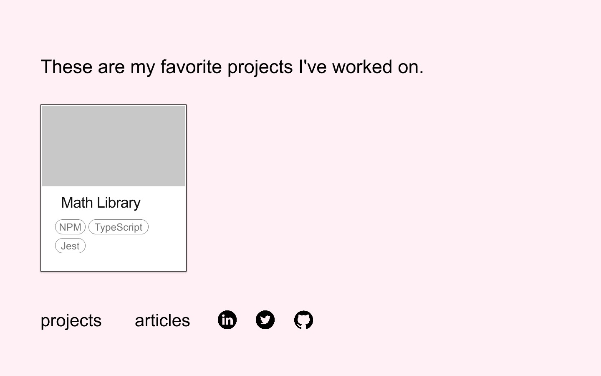

  

:wave:
:woman_technologist:
`tori.dev` is my personal website which you can view [here](https://tori.dev). The goal was to create a portfolio that was served using an API for easily updating my projects and articles with clean, well documented code.

This MVP was created in only **4 days**: 1 to design the website, and 3 to code and ship.

Written in React and Sass, and served via my [authenticated Django API](https://t0ri-make-school-coursework.github.io/create-portfolio-backend/#/).

Code quality was enforced using the ESLint Airbnb style guide!

  
  
  

## Designs

  
  
  

These designs were made in InVision Studio on the Monday of my M-Th sprint.

I initially wireframed them on paper through several iterations.

## Future Plans
*(version 3 planned to ship August 2020!)*
- ~Responsive design~ 
- More interactions
- Add relevant content
- ~Preload projects~
- Bug fixes

## Pitch
View my short pitch deck for my college [here](./public/img/PORTFOLIO.pdf).
